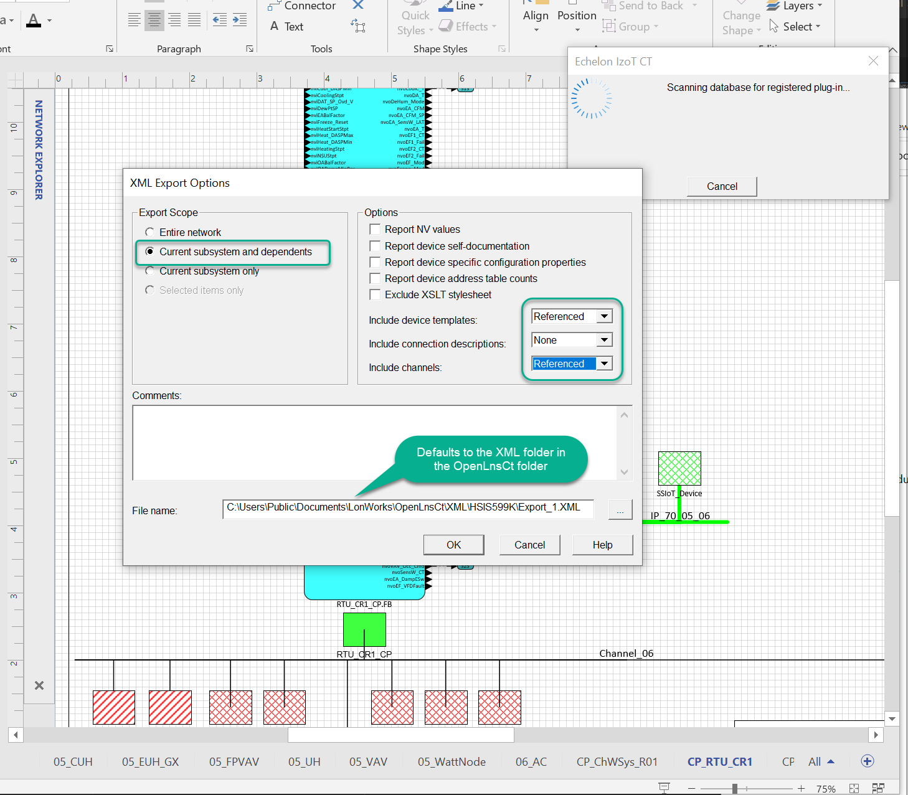

# ExportSurvey Utility (exportSurvey.exe)
--- 
This report utility processes XML Subsystem report to summarize the resources needed to fully represent the datapoints in a IzoT CT based network you intend to export to the SmartServer IoT using `inex.exe`. Armed with this information, you can gather and pre-load resources to improve results migrating existing systems to the SmartServer IoT.

This application is a standalone executable that should be added to your `../lonworks/bin` folder.  

## Instructions
This workflow uses the SmartServer IoT in IMM mode.
1. Prepare for the `inex` by creating a subsystem that will contain assets you want to export.
2. In IzoT CT, move device shapes for assets you want to export to the subsystem created in the previous step.
3. Add the smartserver internal device `SmartServerIoT.xif` and necessary routers and channels to the design.  
4. In CT with the export subsystem as your current subsystem, Right-click the drawing page and launch the XML export plugin.

4. Select these options: 

5. Use file explorer to navigate to the folder that contains the XML Export file.  Type `cmd` in the file explorer address box to launch a command window with the export file folder as the current working directory.
6. Type: `exportSurvey ./Export.xml`

Here is an example of the output generated (exportReport.csv) by this utility.  

The exportSurvey also generates the file `deviceTypes.dtd` in the same folder.  You can add this to a .zip archive that includes the XIF files to create a device type package that can be imported by the Device Type widget in the CMS.  Once imported, you can use the `/skipfiles` option when running `inex.exe` 

## Release Notes
***
**12/15/2021 - Release 1.00.002**: 
1. Fixed issues with file path handling.
2. Fixed bugs found when working with more complex actual projects.
3. Added the dtd file generation feature. 

**12/15/2021 - Release 1.00.003**: Added user type summary to the console output.

**12/15/2021 - Release 1.00.004**: Fixed issue with duplicate device type reporting.