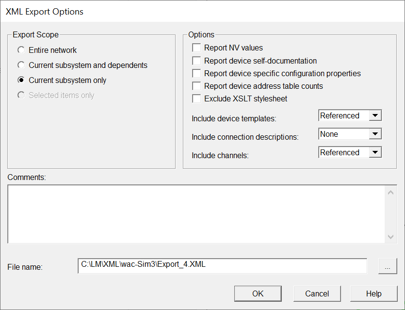

# typeFix.exe
---
If your IzoT CT/SmartServer IoT migration includes an Internal device with dynamic network variables modeled against UNVT types on external devices, the type information will not be applied to the IAP/MQ representation of the datapoint. The data for these points will be rendered as hex encoded bytes. The typeFix.exe utility application uses the XML report generated by the IzoT CT XML Subsystem Report plug-in to generate the data input file used for this application to attach the XML resources to these UNVT typed data points to provide useable JSON formatted values.

In this workflow, it is important that the internal device IAP/MQ handle, and the IzoT CT device name are exact matches as shown in this screen clipping.

To create the needed XML Report open your IzoT CT project and navigate to the subsystem that has the device shape of your SmartServer IoT internal device that contains the dynamic interface.  Right-click the drawing page an launch the XML Report Plug-in.

 

Select these options

The XML report file will be saved in a folder XML/[database name] at the same level as the CT drawing directory.  
## Notes 
1. You must have suitable XML type files to match the resources used in the IzoT CT project.
2. The internal application device must be created using localDev.js after the resource files, and XIF file are imported using the CMS device widget.
3. The application will initialize the Name property of the Functional block to match the name used in IzoT CT. 

Here is an example of an fixTypes.exe command line:
` fixTypes Export.xml dyn-1 192.168.10.119`

## Release Notes
8/10/2021 - Initial release, 1.00.001

8/11/2021 - 1.00.002
Added support for extenal device type fixes.  Use '*' as a wildcard device handle 

12/03/2021 - 1.00.003a 
Fixed issue with function block index and file path.    